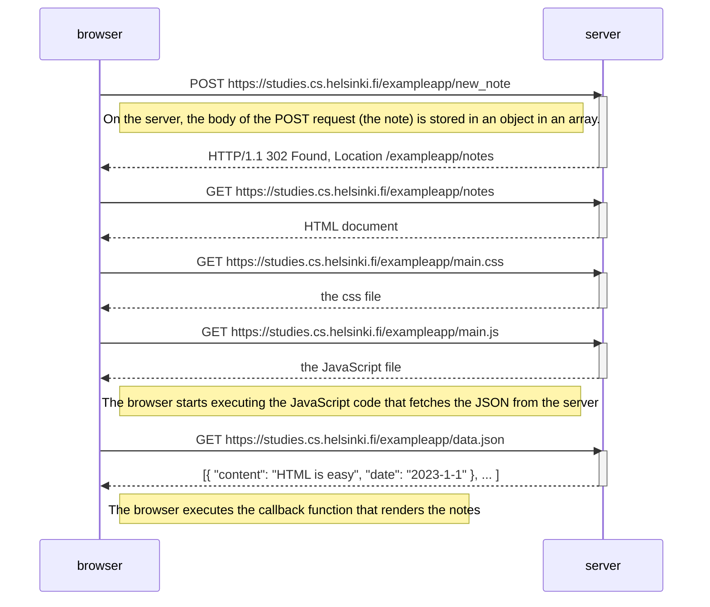

# 0.4 Diagram for creating new notes

In this exercise we will create a diagram showing the chain of events when a user creates a new note on the page from the example app at [https://studies.cs.helsinki.fi/exampleapp/notes](https://studies.cs.helsinki.fi/exampleapp/notes).

## Diagram

## Explanation

After a user has typed some content in the input field, and clicks the "Save"-button, a POST request is sent to the server containing the information in the input field (the payload). 

After storing the note on the server, it responds with a 302 code and tell the browser which location to go to. This location is the same page as the note was sent from, so the current page will be reloaded.

When the page is reloaded, the same process as when we first accessed the page will follow as before:

* GET request to the server returns the HTML document which the browser starts to parse.
* GET request to get the CSS file when the browser reads the HTML document and finds it needs the CSS file.
* GET request to get the client side javascript file when the HTML requires it.
* GET request from the client side script to get all the notes in a JSON-file.
* Finally, the client side script renders a bulleted list with all the notes.